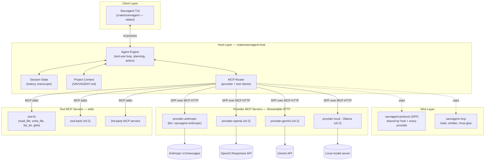

# Savvagent — Product Requirements Document

**Status:** Draft v0.1 · **Owner:** Rob Hicks · **Last updated:** 2026-05-01

---

## 1. Vision

**Savvagent is a blazingly fast, open-source terminal coding agent — written end-to-end in Rust, with every LLM provider and every tool implemented as a Model Context Protocol (MCP) server.**

Adding a new model is writing a small standalone binary. Adding a new tool is writing a small standalone binary. The host is just an MCP client that orchestrates them and renders a TUI.

If [OpenCode](https://opencode.ai/) is the reference experience, Savvagent's pitch is the same UX with three things that matter:

1. **Speed.** Native Rust everywhere — TUI, host, providers, tools. No Node/Go runtime overhead, no JSON-only IPC layer between the engine and the renderer.
2. **MCP-native.** OpenCode treats MCP as one tool source among many; Savvagent treats MCP as *the* wire format for both tools *and* providers. One transport story to learn.
3. **Provider-as-binary.** Forking Savvagent to add a model means publishing a new crate, not patching the host.

---

## 2. Why now

The terminal-AI-coding-agent niche is established (Aider, Claude Code, OpenCode, Continue, …) but the OSS Rust slot is empty, and no major agent has bet on MCP as the *provider* transport. Most agents have:

- A monolithic binary with hard-coded provider SDKs.
- A separate (and lossy) plug-in story for tools.
- Latency that you feel in every keystroke through the TUI.

Savvagent's bet: by collapsing both halves onto MCP and writing the host in Rust, we get a smaller core, a sharper extension story, and a TUI that feels instant.

---

## 3. Inspiration: OpenCode

The diagram below is the OpenCode system architecture, adapted as our reference. Savvagent keeps most of these layers but flattens the Provider System and Tool System onto the same protocol.


What we keep from this picture:

- **Three-layer split** — client (TUI) ⇢ server-side engine ⇢ external providers.
- **State management** owned by the engine (sessions, history).
- **Project context** loaded from a well-known file (OpenCode uses `AGENTS.md`; Savvagent will use `SAVVAGENT.md`).
- **MCP for tool servers.**

What we change:

- **The Provider System is also MCP.** No internal `Provider` trait wrapping vendor SDKs — every provider is a separate binary speaking MCP Streamable HTTP, conforming to **SPP** (see §6).
- **One client to start.** Just the TUI. No SolidJS desktop, no IDE extensions, no Agent Client Protocol (ACP) — those become open questions for v0.3+.
- **Rust everywhere**, including the TUI (ratatui).

---

## 4. Goals & non-goals

### Goals (v0.1 MVP)

- A working terminal agent that can hold a multi-turn conversation with Claude, read and edit files in the current project, and run commands — with sub-100 ms TUI input latency under typical use.
- A clean separation in which `savvagent-host` knows nothing about Anthropic, and `provider-anthropic` knows nothing about the TUI.
- A protocol (SPP) frozen enough to publish v0.1 on crates.io.
- Building Savvagent from a fresh clone on Linux/macOS should be `cargo install savvagent` and one env var (`ANTHROPIC_API_KEY`).

### Non-goals (v0.1)

- Multi-provider parity — Anthropic only, others stubbed for v0.2.
- Desktop or IDE clients.
- LSP integration.
- Sandboxing / permission prompts (tools run with the user's privileges; users are warned).
- Multi-session UI, conversation branching, undo.
- Auth beyond API keys in env / config file.
- Caching policy (providers decide for now).

### Explicit non-goals (long-term)

- Becoming a generic MCP IDE shell. Savvagent is opinionated about being an *agent* host, not a tool browser.
- Bundling vendor SDKs in the host crate. SDK-style code lives in per-provider binaries.

---

## 5. Architecture

### 5.1 System diagram



### 5.2 Layer responsibilities

| Layer | Crate(s) | Responsibility |
|---|---|---|
| Client | `savvagent` | TUI rendering, input handling, talks to host in-process via Rust API |
| Host | `savvagent-host` | Conversation state, tool-use loop, MCP client orchestration, project context |
| Wire | `savvagent-protocol`, `savvagent-mcp` | Shared types (SPP) and traits / rmcp glue |
| Providers | `provider-anthropic`, `provider-openai` (v0.2), … | Translate SPP ⇄ vendor API; ship as standalone MCP servers |
| Tools | `tool-fs`, `tool-bash` (v0.2), 3rd-party | Standard MCP servers; the host only sees `tools/list` + `tools/call` |

### 5.3 Workspace layout

```
ai-coder/
├── PRD.md                 ← this document
├── Cargo.toml             ← workspace
├── docs/images/           ← diagrams (incl. OpenCode reference)
└── crates/
    ├── savvagent/                ← TUI (formerly src/)
    ├── savvagent-protocol/       ← SPP wire types + SPEC.md
    ├── savvagent-mcp/            ← shared traits, ChannelEmitter
    ├── savvagent-host/           ← engine, router, project context
    ├── provider-anthropic/       ← Anthropic provider + savvagent-anthropic bin
    └── tool-fs/                  ← filesystem tools + savvagent-tool-fs bin
```

---

## 6. The wire: Savvagent Provider Protocol (SPP)

The contract between host and provider servers is **SPP v0.1.0**, defined in `crates/savvagent-protocol/SPEC.md`. Headline points:

- One required tool per provider: `complete`.
- Input: `CompleteRequest` (model, messages, tools, max_tokens, optional streaming/thinking).
- Output: `CompleteResponse` or MCP tool error containing `ProviderError`.
- Streaming via MCP `notifications/progress` carrying `StreamEvent`s, gated by `STREAM_EVENT_KIND = "savvagent/stream-event"`.
- Optional `list_models`, `count_tokens` tools.

Hosts must not require optional tools. Providers configure auth out-of-band.

See `crates/savvagent-protocol/SPEC.md` for the complete spec and JSON schemas.

---

## 7. Milestones

We ship in dependency order. Each milestone is independently demoable.

### M1 · Protocol & traits (✅ done)
- `savvagent-protocol` v0.1.0 with full round-trip tests.
- `savvagent-mcp` `ProviderHandler` / `ProviderClient` / `StreamEmitter` traits + `ChannelEmitter`.
- **Demo:** `cargo test -p savvagent-protocol -p savvagent-mcp`.

### M2 · Anthropic provider as an MCP server
- Wrap `AnthropicProvider` in an `rmcp` Streamable HTTP server inside the `savvagent-anthropic` bin.
- End-to-end: `savvagent-anthropic` binary listens on a port; an `rmcp` test client can call `tools/call complete` and stream events.
- **Demo:** integration test using `rmcp` Streamable HTTP client → server in-process; one-shot + streaming.
- **Acceptance:** non-streaming and streaming completions both round-trip; SSE → SPP `StreamEvent` adapter passes a frozen fixture.

### M3 · `tool-fs` stdio MCP server (unblocks workspace build)
- Implement `read_file`, `write_file`, `list_dir`, `glob` as a stdio MCP server.
- Use `rmcp` `transport-io` server.
- **Demo:** `echo '{...}' | savvagent-tool-fs` round-trips a `tools/call read_file`.
- **Acceptance:** `cargo check --workspace` passes; integration test spawns the binary as a child process and exercises every tool.

### M4 · `savvagent-host` engine
- Spawn provider (HTTP child or external) and tool (stdio child) MCP servers from config.
- Conversation state, tool-use loop, transcript storage in memory.
- Public Rust API the TUI consumes (no IPC yet — the TUI links the host as a library).
- Load `SAVVAGENT.md` from the project root if present.
- **Demo:** a tiny `examples/headless.rs` that runs a multi-turn conversation calling `tool-fs` against a temp dir.
- **Acceptance:** scripted scenario "list current dir, then read Cargo.toml, then summarize" succeeds end-to-end.

### M5 · `savvagent` TUI on the host
- Rip out the legacy `src/llm/*` clients and `src/tools/*` calls; route everything through `savvagent-host`.
- Keep current keybindings; add a streaming-token render path.
- **Demo:** real interactive session against Claude with file edits.
- **Acceptance:** sub-100 ms keystroke-to-render p99 on a warm session; clean exit on Ctrl-C; transcript saved to `~/.savvagent/transcripts/`.

### M6 · Public release v0.1.0
- Crates published: `savvagent-protocol`, `savvagent-mcp`, `savvagent-host`, `provider-anthropic`, `tool-fs`, `savvagent`.
- Binary tarballs for Linux x86_64 / aarch64 and macOS arm64.
- README with one-paragraph install + first-run instructions.
- License: MIT OR Apache-2.0 (already configured in workspace).

### Post-v0.1 (v0.2 candidates, not committed)

- Providers: OpenAI, Gemini, local (Ollama).
- Tools: bash (with allowlist), edit (structured), grep, glob (richer than fs glob).
- Permissions / confirmation prompts before destructive tool calls.
- Session persistence + resume.
- Slash commands (`/clear`, `/model`, `/tools`).
- v0.3+: LSP integration, IDE extensions (ACP-style), desktop app.

---

## 8. Success criteria

For v0.1 release, "done" means:

1. **It works.** A new user can `cargo install savvagent`, set `ANTHROPIC_API_KEY`, run `savvagent` in a project, and hold a multi-turn conversation that reads/writes files.
2. **It's fast.** TUI keystroke-to-render p99 ≤ 100 ms. Host-to-Anthropic first-token-latency overhead ≤ 20 ms (i.e. our processing adds little to the network round-trip).
3. **It's small.** Single Anthropic provider binary < 8 MB stripped release. Host + TUI binary < 12 MB stripped release.
4. **It's hackable.** A new contributor can add a provider in < 200 LOC by copying `provider-anthropic` and swapping the translation layer.

---

## 9. Risks & open questions

- **rmcp maturity.** `rmcp` v1.6 is the assumed substrate; if its Streamable HTTP server has gaps, we may need to vendor / patch. Mitigation: M2 is the integration test — we'll know early.
- **MCP framing for streaming.** Wrapping vendor SSE → MCP progress notifications is a per-provider concern. We're betting the SPP `StreamEvent` shape is stable enough not to leak vendor quirks; round-trip tests guard this.
- **Project context format.** Is `SAVVAGENT.md` enough, or do we need YAML front-matter for tool allowlists, model pinning, etc.? Open until M4.
- **Tool sandboxing in v0.1.** We're shipping with no sandbox, only a warning. Acceptable for v0.1 because the user is opting in via `cargo install`, but it's the highest-priority follow-up in v0.2.
- **Multi-client transport.** v0.1 has the TUI link the host as a library. If we ever add a desktop client, we'll need a real wire (websocket? ACP? gRPC?). Deferred — the host's Rust API is the boundary that matters today.
- **TUI editor widget.** Both the prompt input and any in-TUI file editing need a text-area widget with multi-line editing, cursor movement, selection, and undo. Candidate: [`tui-textarea`](https://github.com/rhysd/tui-textarea) — a ratatui-compatible widget by rhysd that already provides these (plus search, syntax-aware behavior via optional features). Decision deferred to M5; tradeoff is the dep weight and styling flexibility vs. rolling our own minimal editor on top of `ratatui::Buffer`. The current `ratatui-code-editor` use is the placeholder we'd replace.
- **Context management / retrieval.** Long sessions and large repos will outgrow the model's context window; we'll need a strategy for selecting which transcript turns, files, and tool outputs to keep in-context. Candidate to evaluate: [`vecstore`](https://crates.io/crates/vecstore) — a pure-Rust embedded vector store that could back semantic recall over transcript history and project files. Decision deferred (post-M5); tradeoffs include embedding model choice (local vs. provider-hosted), index footprint, and whether retrieval lives in the host or behind an MCP tool server.

---

## 10. Glossary

- **MCP** — Model Context Protocol. The transport for both tools and providers.
- **SPP** — Savvagent Provider Protocol. A small layering on top of MCP defining the `complete` tool's request/response/event shapes. See `crates/savvagent-protocol/SPEC.md`.
- **Provider server** — an MCP server, one per LLM vendor, exposing `complete` over Streamable HTTP.
- **Tool server** — an MCP server exposing arbitrary tools over stdio.
- **Host** — `savvagent-host`. Owns conversation state, runs the tool-use loop, multiplexes provider + tool MCP clients.
- **Client** — for v0.1, the `savvagent` TUI. Future: desktop / IDE.
