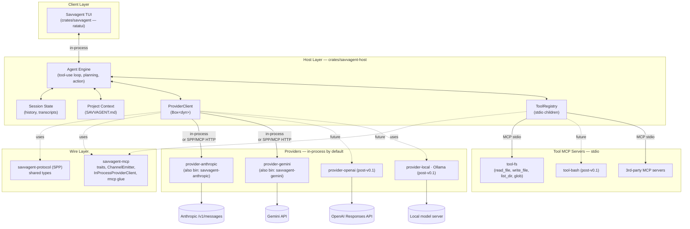

# Savvagent — Product Requirements Document

**Status:** Draft v0.4 · **Owner:** Rob Hicks · **Last updated:** 2026-05-09

---

## 1. Vision

**Savvagent is a blazingly fast, open-source terminal coding agent — written end-to-end in Rust, with every LLM provider and every tool implemented as a Model Context Protocol (MCP) server.**

Adding a new model is writing a small standalone binary. Adding a new tool is writing a small standalone binary. The host is just an MCP client that orchestrates them and renders a TUI.

If [OpenCode](https://opencode.ai/) is the reference experience, Savvagent's pitch is the same UX with three things that matter:

1. **Speed.** Native Rust everywhere — TUI, host, providers, tools. No Node/Go runtime overhead, no JSON-only IPC layer between the engine and the renderer.
2. **MCP-native.** OpenCode treats MCP as one tool source among many; Savvagent treats MCP as *the* wire format for both tools *and* providers. One transport story to learn.
3. **Provider-as-binary.** Forking Savvagent to add a model means publishing a new crate, not patching the host.

---

## 2. Why now

The terminal-AI-coding-agent niche is established (Aider, Claude Code, OpenCode, Continue, …) but the OSS Rust slot is empty, and no major agent has bet on MCP as the *provider* transport. Most agents have:

- A monolithic binary with hard-coded provider SDKs.
- A separate (and lossy) plug-in story for tools.
- Latency that you feel in every keystroke through the TUI.

Savvagent's bet: by collapsing both halves onto MCP and writing the host in Rust, we get a smaller core, a sharper extension story, and a TUI that feels instant.

---

## 3. Inspiration: OpenCode

The diagram below is the OpenCode system architecture, adapted as our reference. Savvagent keeps most of these layers but flattens the Provider System and Tool System onto the same protocol.


What we keep from this picture:

- **Three-layer split** — client (TUI) ⇢ server-side engine ⇢ external providers.
- **State management** owned by the engine (sessions, history).
- **Project context** loaded from a well-known file (OpenCode uses `AGENTS.md`; Savvagent will use `SAVVAGENT.md`).
- **MCP for tool servers.**

What we change:

- **The Provider System is also MCP-shaped.** Every provider implements the same `ProviderHandler` trait and conforms to **SPP** (see §6). Providers are **linked in-process by default** via `InProcessProviderClient` (zero-RPC for the common case) and *also* ship as standalone MCP Streamable HTTP servers for wire-protocol debugging or out-of-process deployments.
- **One client to start.** Just the TUI. No SolidJS desktop, no IDE extensions, no Agent Client Protocol (ACP) — those become open questions for v0.3+.
- **Rust everywhere**, including the TUI (ratatui).

---

## 4. Goals & non-goals

### Goals (v0.1 MVP)

- A working terminal agent that can hold a multi-turn conversation with Anthropic or Gemini, read and edit files in the current project, and run commands — with sub-100 ms TUI input latency under typical use.
- A clean separation in which `savvagent-host` knows nothing about Anthropic, and `provider-anthropic` knows nothing about the TUI.
- A protocol (SPP) frozen enough to publish v0.1 on crates.io.
- Installing Savvagent on Linux/macOS/Windows should be downloading a single archive (or running a one-line install script) plus authenticating with a provider — either an env var like `ANTHROPIC_API_KEY` or running `/connect` once to store the key in the OS keyring. Each platform archive bundles the TUI plus the `savvagent-tool-fs` / `savvagent-anthropic` / `savvagent-gemini` MCP servers under a single installer.

### Non-goals (v0.1)

- Full multi-provider coverage — Anthropic and Gemini ship in v0.1; OpenAI and local-model (Ollama) providers are post-v0.1.
- Desktop or IDE clients.
- LSP integration.
- Sandboxing / permission prompts (tools run with the user's privileges; users are warned).
- Multi-session UI, conversation branching, undo.
- Auth beyond API keys in env / config file.
- Caching policy (providers decide for now).

### Explicit non-goals (long-term)

- Becoming a generic MCP IDE shell. Savvagent is opinionated about being an *agent* host, not a tool browser.
- Bundling vendor SDKs in the host crate. SDK-style code lives in per-provider binaries.

---

## 5. Architecture

### 5.1 System diagram



### 5.2 Layer responsibilities

| Layer | Crate(s) | Responsibility |
|---|---|---|
| Client | `savvagent` | TUI rendering, input handling, talks to host in-process via Rust API |
| Host | `savvagent-host` | Conversation state, tool-use loop, MCP client orchestration, project context |
| Wire | `savvagent-protocol`, `savvagent-mcp` | Shared SPP types, `ProviderHandler` / `ProviderClient` traits, `InProcessProviderClient` bridge, rmcp glue |
| Providers | `provider-anthropic`, `provider-gemini`, … | Translate SPP ⇄ vendor API; linked in-process by default, also ship as standalone MCP Streamable HTTP servers |
| Tools | `tool-fs`, `tool-bash` (post-v0.1), 3rd-party | Standard MCP servers; the host only sees `tools/list` + `tools/call` |

### 5.3 Workspace layout

```
ai-coder/
├── PRD.md                 ← this document
├── Cargo.toml             ← workspace
├── docs/images/           ← diagrams (incl. OpenCode reference)
└── crates/
    ├── savvagent/                ← TUI (formerly src/)
    ├── savvagent-protocol/       ← SPP wire types + SPEC.md
    ├── savvagent-mcp/            ← shared traits, ChannelEmitter, InProcessProviderClient
    ├── savvagent-host/           ← engine, ProviderClient + ToolRegistry, project context
    ├── provider-anthropic/       ← Anthropic provider + savvagent-anthropic bin
    ├── provider-gemini/          ← Gemini provider + savvagent-gemini bin
    └── tool-fs/                  ← filesystem tools + savvagent-tool-fs bin
```

---

## 6. The wire: Savvagent Provider Protocol (SPP)

The contract between host and provider servers is **SPP v0.1.0**, defined in `crates/savvagent-protocol/SPEC.md`. Headline points:

- One required tool per provider: `complete`.
- Input: `CompleteRequest` (model, messages, tools, max_tokens, optional streaming/thinking).
- Output: `CompleteResponse` or MCP tool error containing `ProviderError`.
- Streaming via MCP `notifications/progress` carrying `StreamEvent`s, gated by `STREAM_EVENT_KIND = "savvagent/stream-event"`.
- Optional `list_models`, `count_tokens` tools.

Hosts must not require optional tools. Providers configure auth out-of-band.

See `crates/savvagent-protocol/SPEC.md` for the complete spec and JSON schemas.

---

## 7. Milestones

M1–M9 are shipped. M7 (v0.2.0) added Layer-1 path containment, M8 (v0.3.0) the `/`-palette, M9 (v0.4.0) Layer-2 permissions + `tool-bash` + the `/tools`/`/model` introspection commands. Sandboxing, additional providers, and session resume remain on the v0.5+ backlog.

### M1 · Protocol & traits (✅ done)
- `savvagent-protocol` v0.1.0 with round-trip tests.
- `savvagent-mcp` `ProviderHandler` / `ProviderClient` / `StreamEmitter` traits + `ChannelEmitter` + `InProcessProviderClient` bridge.

### M2 · Anthropic provider (✅ done)
- `provider-anthropic` library implements `ProviderHandler`; the `savvagent-anthropic` bin wraps it as an `rmcp` Streamable HTTP server.
- Host links the provider in-process by default; the HTTP path is opt-in via `SAVVAGENT_PROVIDER_URL` and exists primarily for wire-protocol debugging.
- Streaming via MCP `notifications/progress` carrying SPP `StreamEvent`s — see the `rmcp` `ProgressDispatcher` gotcha in `CLAUDE.md`.

### M3 · `tool-fs` stdio MCP server (✅ done)
- `read_file`, `write_file`, `list_dir`, `glob` ship as a stdio MCP server (`savvagent-tool-fs`), spawned and reaped by `ToolRegistry`.

### M4 · `savvagent-host` engine (✅ done)
- `Host` owns conversation state, the tool-use loop (`run_turn_streaming`), in-memory transcripts, and project context (`SAVVAGENT.md`).
- Public Rust API the TUI consumes; no provider registry inside the host — it just holds a `Box<dyn ProviderClient>` plus a `ToolRegistry`.
- `examples/headless.rs` exercises the loop end-to-end against `tool-fs`.

### M5 · `savvagent` TUI on the host (✅ done)
- TUI routes every turn through `savvagent-host` with a streaming-token render path; transcripts persist to `~/.savvagent/transcripts/<unix>.json`.
- `/connect` swaps the active host atomically (keyring-backed credentials, `Arc<RwLock<Option<Arc<Host>>>>`); `/save` persists transcripts on demand; `/view` and `/edit` open files in the in-TUI viewer/editor.
- A second provider (`provider-gemini`) ships alongside Anthropic, validating the in-process bridge.

### M6 · Public release v0.1.0 (✅ done)
- Distributed via [`cargo-dist`](https://opensource.axo.dev/cargo-dist/): `.tar.xz` for Linux (x86_64 / aarch64) and macOS arm64, `.zip` for Windows x86_64, plus shell (`curl | sh`) and PowerShell (`irm | iex`) installers from GitHub Releases. Config in `[workspace.metadata.dist]`, workflow at `.github/workflows/release.yml`.
- License: AGPL-3.0-or-later.
- Crates.io publication remains deferred until there's an external consumer for the libraries.
- TUI editor widget decision (see §9): `tui-textarea` for the prompt input; `ratatui-code-editor` retained for the in-TUI viewer/editor pending a future consolidation pass.

### M7 · v0.2.0 — `tool-fs` Layer 1 path containment + `/connect` UX (✅ done)
- `tool-fs` confines paths to `SAVVAGENT_TOOL_FS_ROOT` (set by the host to the project root); rejects `..`, symlink escapes, and out-of-root absolute paths. Closes the v0.1 §9 "Layer 1 path hygiene" gap.
- `/connect` gained a skip-prompt path for users who already have a key in the keyring or env.

### M8 · v0.3.0 — Slash-command palette + `/clear` (✅ done)
- Typing `/` opens a command palette with live prefix filtering; previously the only entry points were typing the full command or pressing `Ctrl-P`.
- `/clear` resets per-turn history without dropping the active provider connection.

### M9 · v0.4.0 — Tool permissions + `tool-bash` + introspection (✅ done)

Closed the highest-priority §9 follow-up (Layer-2 permission prompts), shipped `tool-bash` as the first meaningful gating target, and rounded out the TUI with `/tools` and `/model` introspection commands.

**Delivered across four independently-reviewable PRs:**

- **PR 1 — host-only foundation.** `permissions.rs` with `Verdict { Allow, Ask, Deny }`, `PermissionDecision`, `Host::resolve_permission`, `TurnEvent::PermissionRequested` / `ToolCallDenied`. The `tools` Mutex is released *before* the oneshot await per the §5.3 CLAUDE.md "never hold a lock across awaits" pattern. The TUI auto-allowed every Ask in this PR so behavior stayed at parity with v0.3 until PR 2 wired the modal.
- **PR 2 — TUI surface.** `InputMode::PermissionPrompt`, the modal (`y` allow / `n` deny / `a` always / `N` never / Esc deny), `/tools` listing tools with `[allow|ask|deny]` badges, `/model` showing current and `/model <id>` reconnecting via the existing host-swap path with optimistic validation. PR 2 also bundled the user-iterated startup splash banner.
- **PR 3 — `tool-bash`.** New `crates/tool-bash` stdio MCP server with `run { command, cwd?, timeout_ms? }`, structured `{ exit_code, stdout, stderr, elapsed_ms, *_truncated, timed_out }` output, default 30 s timeout (5 min cap), 1 MiB per-stream output cap, Layer-1 `cwd` containment via `SAVVAGENT_TOOL_BASH_ROOT`. **No in-tool allowlist** — every invocation flows through the host's `bash: ask` default. The TUI's single `tool_bin: Option<&Path>` argument became a `ToolBins { fs, bash }` struct so future tool servers plug in by adding a field.
- **PR 4 — layered config + persistence.** `ArgPattern { Any, Path, Command }` replaces PR 2's strict-equality session rules. `Path` patterns match component-wise via `Path::starts_with` (so an editing pass on `permissions.toml` from `src/lib.rs` to `src` generalizes correctly); `Command` patterns match the first whitespace-separated token of `args["command"]`. `evaluate` walks four sources and returns the first match: sensitive-path floor → `SAVVAGENT.md` front-matter → `~/.savvagent/permissions.toml` → built-in defaults. Within a source, first match wins (firewall semantics — place more-specific deny entries above more-general allow entries). `add_rule` writes through to disk so Always/Never decisions persist across sessions. Front-matter parsed via `serde_yaml_ng` + a manual `---` splitter (no `gray_matter` dep), with silent fallback on parse error.

**Inviolable security floor.** `.env*` files and any path under `.ssh/` always return `Deny`, even when an explicit `allow` rule appears in front-matter or `permissions.toml`. Verified by a dedicated permissions test.

**Out of scope (kept for v0.5.0+).** Layer-3 OS sandboxing (bubblewrap / sandbox-exec), OpenAI / Ollama providers, session resume, `tool-grep` / structured `tool-edit`, richer `glob`, crates.io publication, glob path patterns, SPP `list_models` for `/model` validation.

### M10 · v0.5.0 — Two providers + session resume + Layer-3 sandboxing (✅ done)

Cleared the four largest items off the v0.4 backlog in one release: a second commercial provider (OpenAI), the first keyless local provider (Ollama), session resume from disk transcripts, and opt-in OS sandboxing for tool spawns.

**Delivered across four independently-reviewable PRs:**

- **PR 5 — `provider-openai`.** New `crates/provider-openai` implementing `ProviderHandler` against OpenAI Chat Completions (`POST /v1/chat/completions`) with SSE streaming and multi-turn tool-call translation (assistant `tool_calls` → SPP `ToolUse` blocks → user `tool` role → continuation). Default model `gpt-4o-mini`; `base_url` configurable for Azure / Ollama-compat / local mock. Standalone `savvagent-openai` Streamable HTTP shim included. Hardened SSE decoder surfaces `Network` errors on truncated streams, short-circuits the emit loop on consumer disconnect, and integration tests mirror the `provider-gemini` coverage profile (round-trip + streaming + tool advertisement against an axum mock).
- **PR 6 — `provider-local` (Ollama).** New `crates/provider-local` against Ollama's `/api/chat` NDJSON streaming. **No API key required** — added `api_key_required: bool` on `ProviderSpec` and a corresponding `health_check: Option<HealthCheckFn>` so the `/connect` flow can both skip the keyring AND probe `/api/tags` with a 3 s timeout, surfacing "Ollama not reachable" rather than a silent first-turn failure. Tool calling works for capable models (llama3.1, qwen2.5); models without tool support gracefully complete. Notable correctness fix during review: the streaming accumulator hardcoded `index: 0` for the text content block, which corrupts deltas when a tool-call chunk arrives before any text — now tracks the active text-block index in `Accumulator`. `OLLAMA_HOST` env var honored as a fallback to the builder's `base_url`. Default model `llama3.2`.
- **PR 7 — Session resume + transcript versioning.** `Host::load_transcript(path)` re-hydrates session message history with a typed `TranscriptError { Io, Malformed, SchemaMismatch }`; on-disk format becomes a versioned `{schema_version, model, saved_at, messages}` wrapper (`TRANSCRIPT_SCHEMA_VERSION = 1`). Pre-resume bare-array files load transparently. New `/resume` slash command opens a transcript picker (newest-first, with timestamp / message-count / first-user-message preview) or accepts `/resume <path>` to load a specific file. Header gains a `(resumed: <ts>)` indicator. `Thinking` content blocks render as `[thinking]` placeholders during replay. **Inviolable invariant:** `/resume` refuses to run while a turn is in flight, because `run_turn_inner` snapshots `state.messages` at turn start and commits its local clone back at turn end — overlap would silently overwrite the resumed history. The picker also pre-filters files whose `messages` field can't be deserialized so they don't make it to the user just to fail at `load_transcript`.
- **PR 8 — Layer-3 OS sandboxing for tool spawns.** New `sandbox.rs` in `savvagent-host` with `SandboxConfig`, `apply_sandbox`, and platform-specific wrappers. Linux uses `bwrap` (`--ro-bind / / --bind <project_root> <project_root> --unshare-net --die-with-parent --new-session`); macOS uses `sandbox-exec` with a TinyScheme profile that denies `file-write*` outside the project root and `network*` unless `allow_net`; Windows logs a one-time warning and runs unwrapped. **Opt-in for v0.5** (`enabled = false` by default). `tool-bash` gets `allow_net = Some(true)` in the default override map because most bash commands (curl, cargo, package managers) need network. New `/sandbox` slash command shows status and toggles via `on`/`off`; persistence to `~/.savvagent/sandbox.toml`. Two notable hardenings during review: (a) the `apply_sandbox` Command rewrite **dropped caller env vars** including `SAVVAGENT_TOOL_FS_ROOT` / `SAVVAGENT_TOOL_BASH_ROOT`, silently disabling Layer-1 path containment when sandboxing was on — fixed by capturing envs+cwd before the rewrite and re-applying after, with a regression test; (b) the macOS profile string-interpolated `project_root` directly into a TinyScheme literal, so a `"` / `\` / newline in a path would break parsing — `build_macos_profile` is now an extracted, testable function with `scheme_quote` escaping.

**Cross-cutting test hygiene.** Six `tool-bash` tests in `BashTools::run` directly invoke `bash -c` and have been failing on Windows since M9 PR 3 (Windows has no `bash` on `$PATH` by default). Gated as `#[cfg(unix)]` so the Windows CI matrix stops failing on a pre-existing infra gap. Path-validation tests stay cross-platform.

**Out of scope (kept for v0.6+).** Default-on sandboxing (v0.5 ships opt-in); Windows AppContainer; macOS profile fuzzing; `tool-grep`; structured `tool-edit`; richer `glob`; crates.io publication; SPP `list_models` for `/model` validation; LSP / ACP IDE integration.

### Backlog beyond v0.5.0

- **Sandbox: default-on + scope-tightening.** v0.5 ships opt-in. Promote to default-on once Layer-2 permission defaults are proven non-annoying in real-world use. Document explicitly that the bwrap / sandbox-exec layer constrains *writes and network*, not *reads* — a compromised tool can still read `~/.ssh/`, `~/.aws/credentials`, browser profiles, etc. Combined with `tool-bash`'s default `allow_net = true`, that's an exfil path worth either narrowing or surfacing in the README before promotion. Windows AppContainer + Job Objects support remains the eventual target.
- **Tools.** `tool-grep`, structured `tool-edit`, richer `glob` than the fs server's.
- **Crates.io publication** of `savvagent-protocol`, `savvagent-mcp`, `savvagent-host` once an external consumer wants them as libraries.
- **v0.6+.** LSP integration, ACP-style IDE extensions, desktop client.

---

## 8. Success criteria

For v0.1 release, "done" means:

1. **It works.** A new user can download a precompiled `savvagent` binary, authenticate with a provider (env var or `/connect`), run it inside a project, and hold a multi-turn conversation that reads/writes files. Crates.io publication is *not* required for v0.1.
2. **It's fast.** TUI keystroke-to-render p99 ≤ 100 ms. Host-to-Anthropic first-token-latency overhead ≤ 20 ms (i.e. our processing adds little to the network round-trip).
3. **It's small (at v0.1).** Stripped release sizes at the v0.1 tag: each provider/tool shim binary ≤ 8 MB, host + TUI binary ≤ 12 MB, full-platform archive (all four binaries) ≤ 36 MB pre-compression. Regression budget: +20% per minor release — anything over that is a release blocker until either justified in writing or the budget is explicitly rebudgeted.
4. **It's hackable.** A new contributor can add a provider in < 200 LOC by copying `provider-anthropic` and swapping the translation layer.

---

## 9. Risks & open questions

- **rmcp maturity.** `rmcp` v1.6 is the assumed substrate; if its Streamable HTTP server has gaps, we may need to vendor / patch. Mitigation: M2 is the integration test — we'll know early.
- **MCP framing for streaming.** Wrapping vendor SSE → MCP progress notifications is a per-provider concern. We're betting the SPP `StreamEvent` shape is stable enough not to leak vendor quirks; round-trip tests guard this.
- **Project context format.** *Resolved in M9.* `SAVVAGENT.md` gains optional YAML front-matter for permission overrides; the body remains free-form Markdown injected into the system prompt. Front-matter parse errors fall back silently to "no front-matter" so a malformed file never blocks startup.
- **Tool sandboxing layer status.** Layer 1 (path hygiene) ✅ landed in M7. Layer 2 (permission prompts) is the M9 deliverable. Layer 3 (OS-level isolation via bubblewrap / sandbox-exec) is deferred to v0.5+; the host already owns the tool spawn path, so wrapping it later is additive.
- **Multi-client transport.** v0.1 has the TUI link the host as a library. If we ever add a desktop client, we'll need a real wire (websocket? ACP? gRPC?). Deferred — the host's Rust API is the boundary that matters today.
- **TUI editor widget.** *Settled in M5/M6.* `tui-textarea` (the `tui-textarea-2` fork) is in for the prompt input. `ratatui-code-editor` remains for the in-TUI viewer/editor; consolidating onto a single widget is a future cleanup, not a release blocker.
- **Context management / retrieval.** Long sessions and large repos will outgrow the model's context window; we'll need a strategy for selecting which transcript turns, files, and tool outputs to keep in-context. Candidate to evaluate: [`vecstore`](https://crates.io/crates/vecstore) — a pure-Rust embedded vector store that could back semantic recall over transcript history and project files. Decision deferred (post-M5); tradeoffs include embedding model choice (local vs. provider-hosted), index footprint, and whether retrieval lives in the host or behind an MCP tool server.

---

## 10. Glossary

- **MCP** — Model Context Protocol. The transport for both tools and providers.
- **SPP** — Savvagent Provider Protocol. A small layering on top of MCP defining the `complete` tool's request/response/event shapes. See `crates/savvagent-protocol/SPEC.md`.
- **Provider server** — an MCP server, one per LLM vendor, exposing `complete` over Streamable HTTP.
- **Tool server** — an MCP server exposing arbitrary tools over stdio.
- **Host** — `savvagent-host`. Owns conversation state, runs the tool-use loop, multiplexes provider + tool MCP clients.
- **Client** — for v0.1, the `savvagent` TUI. Future: desktop / IDE.
