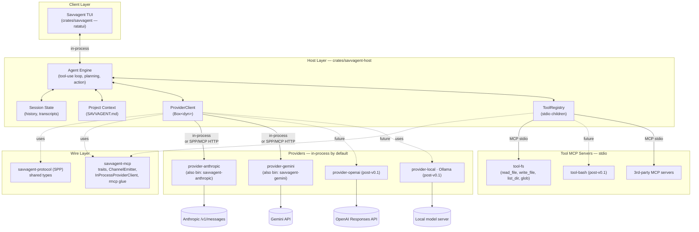

# Savvagent — Product Requirements Document

**Status:** Draft v0.4 · **Owner:** Rob Hicks · **Last updated:** 2026-05-09

---

## 1. Vision

**Savvagent is a blazingly fast, open-source terminal coding agent — written end-to-end in Rust, with every LLM provider and every tool implemented as a Model Context Protocol (MCP) server.**

Adding a new model is writing a small standalone binary. Adding a new tool is writing a small standalone binary. The host is just an MCP client that orchestrates them and renders a TUI.

If [OpenCode](https://opencode.ai/) is the reference experience, Savvagent's pitch is the same UX with three things that matter:

1. **Speed.** Native Rust everywhere — TUI, host, providers, tools. No Node/Go runtime overhead, no JSON-only IPC layer between the engine and the renderer.
2. **MCP-native.** OpenCode treats MCP as one tool source among many; Savvagent treats MCP as *the* wire format for both tools *and* providers. One transport story to learn.
3. **Provider-as-binary.** Forking Savvagent to add a model means publishing a new crate, not patching the host.

---

## 2. Why now

The terminal-AI-coding-agent niche is established (Aider, Claude Code, OpenCode, Continue, …) but the OSS Rust slot is empty, and no major agent has bet on MCP as the *provider* transport. Most agents have:

- A monolithic binary with hard-coded provider SDKs.
- A separate (and lossy) plug-in story for tools.
- Latency that you feel in every keystroke through the TUI.

Savvagent's bet: by collapsing both halves onto MCP and writing the host in Rust, we get a smaller core, a sharper extension story, and a TUI that feels instant.

---

## 3. Inspiration: OpenCode

The diagram below is the OpenCode system architecture, adapted as our reference. Savvagent keeps most of these layers but flattens the Provider System and Tool System onto the same protocol.


What we keep from this picture:

- **Three-layer split** — client (TUI) ⇢ server-side engine ⇢ external providers.
- **State management** owned by the engine (sessions, history).
- **Project context** loaded from a well-known file (OpenCode uses `AGENTS.md`; Savvagent will use `SAVVAGENT.md`).
- **MCP for tool servers.**

What we change:

- **The Provider System is also MCP-shaped.** Every provider implements the same `ProviderHandler` trait and conforms to **SPP** (see §6). Providers are **linked in-process by default** via `InProcessProviderClient` (zero-RPC for the common case) and *also* ship as standalone MCP Streamable HTTP servers for wire-protocol debugging or out-of-process deployments.
- **One client to start.** Just the TUI. No SolidJS desktop, no IDE extensions, no Agent Client Protocol (ACP) — those become open questions for v0.3+.
- **Rust everywhere**, including the TUI (ratatui).

---

## 4. Goals & non-goals

### Goals (v0.1 MVP)

- A working terminal agent that can hold a multi-turn conversation with Anthropic or Gemini, read and edit files in the current project, and run commands — with sub-100 ms TUI input latency under typical use.
- A clean separation in which `savvagent-host` knows nothing about Anthropic, and `provider-anthropic` knows nothing about the TUI.
- A protocol (SPP) frozen enough to publish v0.1 on crates.io.
- Installing Savvagent on Linux/macOS/Windows should be downloading a single archive (or running a one-line install script) plus authenticating with a provider — either an env var like `ANTHROPIC_API_KEY` or running `/connect` once to store the key in the OS keyring. Each platform archive bundles the TUI plus the `savvagent-tool-fs` / `savvagent-anthropic` / `savvagent-gemini` MCP servers under a single installer.

### Non-goals (v0.1)

- Full multi-provider coverage — Anthropic and Gemini ship in v0.1; OpenAI and local-model (Ollama) providers are post-v0.1.
- Desktop or IDE clients.
- LSP integration.
- Sandboxing / permission prompts (tools run with the user's privileges; users are warned).
- Multi-session UI, conversation branching, undo.
- Auth beyond API keys in env / config file.
- Caching policy (providers decide for now).

### Explicit non-goals (long-term)

- Becoming a generic MCP IDE shell. Savvagent is opinionated about being an *agent* host, not a tool browser.
- Bundling vendor SDKs in the host crate. SDK-style code lives in per-provider binaries.

---

## 5. Architecture

### 5.1 System diagram



### 5.2 Layer responsibilities

| Layer | Crate(s) | Responsibility |
|---|---|---|
| Client | `savvagent` | TUI rendering, input handling, talks to host in-process via Rust API |
| Host | `savvagent-host` | Conversation state, tool-use loop, MCP client orchestration, project context |
| Wire | `savvagent-protocol`, `savvagent-mcp` | Shared SPP types, `ProviderHandler` / `ProviderClient` traits, `InProcessProviderClient` bridge, rmcp glue |
| Providers | `provider-anthropic`, `provider-gemini`, … | Translate SPP ⇄ vendor API; linked in-process by default, also ship as standalone MCP Streamable HTTP servers |
| Tools | `tool-fs`, `tool-bash` (post-v0.1), 3rd-party | Standard MCP servers; the host only sees `tools/list` + `tools/call` |

### 5.3 Workspace layout

```
ai-coder/
├── PRD.md                 ← this document
├── Cargo.toml             ← workspace
├── docs/images/           ← diagrams (incl. OpenCode reference)
└── crates/
    ├── savvagent/                ← TUI (formerly src/)
    ├── savvagent-protocol/       ← SPP wire types + SPEC.md
    ├── savvagent-mcp/            ← shared traits, ChannelEmitter, InProcessProviderClient
    ├── savvagent-host/           ← engine, ProviderClient + ToolRegistry, project context
    ├── provider-anthropic/       ← Anthropic provider + savvagent-anthropic bin
    ├── provider-gemini/          ← Gemini provider + savvagent-gemini bin
    └── tool-fs/                  ← filesystem tools + savvagent-tool-fs bin
```

---

## 6. The wire: Savvagent Provider Protocol (SPP)

The contract between host and provider servers is **SPP v0.1.0**, defined in `crates/savvagent-protocol/SPEC.md`. Headline points:

- One required tool per provider: `complete`.
- Input: `CompleteRequest` (model, messages, tools, max_tokens, optional streaming/thinking).
- Output: `CompleteResponse` or MCP tool error containing `ProviderError`.
- Streaming via MCP `notifications/progress` carrying `StreamEvent`s, gated by `STREAM_EVENT_KIND = "savvagent/stream-event"`.
- Optional `list_models`, `count_tokens` tools.

Hosts must not require optional tools. Providers configure auth out-of-band.

See `crates/savvagent-protocol/SPEC.md` for the complete spec and JSON schemas.

---

## 7. Milestones

M1–M6 are shipped (v0.1.0). M7 (v0.2.0) and M8 (v0.3.0) added Layer-1 path containment and the `/`-palette; **M9 is the proposed v0.4.0 milestone** focused on Layer-2 permissions plus `tool-bash`.

### M1 · Protocol & traits (✅ done)
- `savvagent-protocol` v0.1.0 with round-trip tests.
- `savvagent-mcp` `ProviderHandler` / `ProviderClient` / `StreamEmitter` traits + `ChannelEmitter` + `InProcessProviderClient` bridge.

### M2 · Anthropic provider (✅ done)
- `provider-anthropic` library implements `ProviderHandler`; the `savvagent-anthropic` bin wraps it as an `rmcp` Streamable HTTP server.
- Host links the provider in-process by default; the HTTP path is opt-in via `SAVVAGENT_PROVIDER_URL` and exists primarily for wire-protocol debugging.
- Streaming via MCP `notifications/progress` carrying SPP `StreamEvent`s — see the `rmcp` `ProgressDispatcher` gotcha in `CLAUDE.md`.

### M3 · `tool-fs` stdio MCP server (✅ done)
- `read_file`, `write_file`, `list_dir`, `glob` ship as a stdio MCP server (`savvagent-tool-fs`), spawned and reaped by `ToolRegistry`.

### M4 · `savvagent-host` engine (✅ done)
- `Host` owns conversation state, the tool-use loop (`run_turn_streaming`), in-memory transcripts, and project context (`SAVVAGENT.md`).
- Public Rust API the TUI consumes; no provider registry inside the host — it just holds a `Box<dyn ProviderClient>` plus a `ToolRegistry`.
- `examples/headless.rs` exercises the loop end-to-end against `tool-fs`.

### M5 · `savvagent` TUI on the host (✅ done)
- TUI routes every turn through `savvagent-host` with a streaming-token render path; transcripts persist to `~/.savvagent/transcripts/<unix>.json`.
- `/connect` swaps the active host atomically (keyring-backed credentials, `Arc<RwLock<Option<Arc<Host>>>>`); `/save` persists transcripts on demand; `/view` and `/edit` open files in the in-TUI viewer/editor.
- A second provider (`provider-gemini`) ships alongside Anthropic, validating the in-process bridge.

### M6 · Public release v0.1.0 (✅ done)
- Distributed via [`cargo-dist`](https://opensource.axo.dev/cargo-dist/): `.tar.xz` for Linux (x86_64 / aarch64) and macOS arm64, `.zip` for Windows x86_64, plus shell (`curl | sh`) and PowerShell (`irm | iex`) installers from GitHub Releases. Config in `[workspace.metadata.dist]`, workflow at `.github/workflows/release.yml`.
- License: MIT OR Apache-2.0.
- Crates.io publication remains deferred until there's an external consumer for the libraries.
- TUI editor widget decision (see §9): `tui-textarea` for the prompt input; `ratatui-code-editor` retained for the in-TUI viewer/editor pending a future consolidation pass.

### M7 · v0.2.0 — `tool-fs` Layer 1 path containment + `/connect` UX (✅ done)
- `tool-fs` confines paths to `SAVVAGENT_TOOL_FS_ROOT` (set by the host to the project root); rejects `..`, symlink escapes, and out-of-root absolute paths. Closes the v0.1 §9 "Layer 1 path hygiene" gap.
- `/connect` gained a skip-prompt path for users who already have a key in the keyring or env.

### M8 · v0.3.0 — Slash-command palette + `/clear` (✅ done)
- Typing `/` opens a command palette with live prefix filtering; previously the only entry points were typing the full command or pressing `Ctrl-P`.
- `/clear` resets per-turn history without dropping the active provider connection.

### M9 · v0.4.0 — Tool permissions + `tool-bash` + introspection (proposed)

**Theme.** Close the highest-priority §9 follow-up (Layer-2 permission prompts), then introduce `tool-bash` so the host has a meaningful target for the new gating, and round out the TUI's introspection commands. Layer-3 OS sandboxing, additional providers, and session resume are explicitly deferred to v0.5.0+.

**Why this bundle.** Permissions, `tool-bash`, and the new introspection commands are mutually load-bearing: shipping `tool-bash` without gating would regress safety; shipping permissions without `tool-bash` leaves `read_file` / `write_file` as the only enforcement surface (and they're already mostly `allow`). `/tools` and `/model` are the commands users will reach for once tool gating exists, so they belong in the same release.

**Scope (acceptance criteria).**

1. **`permissions.rs` in `savvagent-host`** — new module exposing `Verdict { Allow, Ask, Deny }` and `PermissionPolicy::evaluate(tool_name, args) -> Verdict`. Layered sources, highest precedence first:
   1. CLI / `HostConfig::with_permission_overrides`
   2. `SAVVAGENT.md` YAML front-matter (new — adds front-matter parsing to `project.rs`)
   3. `~/.savvagent/permissions.toml`
   4. Built-in defaults: `read_file: allow`, `write_file: allow` inside `project_root` and `ask` outside, `bash: ask` always, paths under `.env` / `~/.ssh`: `deny`.
2. **Turn-loop integration in `session.rs`** — `Host::run_turn_streaming` consults `policy.evaluate` before every `ToolRegistry::call`:
   - `Allow` proceeds unchanged.
   - `Deny` synthesizes a `tool_result` with `is_error: true` and a "denied by policy" payload; emits `TurnEvent::ToolCallDenied { name, reason }`.
   - `Ask` emits `TurnEvent::PermissionRequested { id, name, summary, args }` and awaits a matching `Host::resolve_permission(id, decision)` via a `oneshot`. Constraint: the `tools` Mutex must be released *before* the await — see CLAUDE.md "never hold a lock across awaits."
3. **TUI permission modal** in `app.rs` / `ui.rs` — new `Mode::PermissionPrompt { id, request }` pauses input and renders the request (tool, summary, expandable args). Keys: `y` allow once, `n` deny once, `a` always (persists to `~/.savvagent/permissions.toml`), `N` never (same), `Esc` deny.
4. **`crates/tool-bash`** — new stdio MCP server mirroring `tool-fs`'s layout. One tool, `run { command, cwd?, timeout_ms? }` (default 30 s), returning structured `{ exit_code, stdout, stderr, elapsed_ms }`. Layer 1 containment via `SAVVAGENT_TOOL_BASH_ROOT` (host sets it to `project_root`). **No allowlist in the tool itself** — gating is the host's job. Bin: `savvagent-tool-bash`, located via `$PATH` or `SAVVAGENT_TOOL_BASH_BIN`, registered in `crates/savvagent/src/main.rs`.
5. **`/tools` and `/model` slash commands** — `/tools` lists registered tools (name + description from `tools/list`) and their current permission verdict. `/model` (no args) shows the current `provider:model`; `/model <id>` triggers a **reconnect through the existing host-swap path** (`Arc<RwLock<Option<Arc<Host>>>>`, same as `/connect` minus the credential prompt) with the new model. Validation is optimistic — the provider rejects at first turn if the id is wrong, with a clear error. Wiring the optional SPP `list_models` tool everywhere is *not* part of M9; it can ship later as an independent cleanup that upgrades `/model` from optimistic to validated. Both commands join the `/` palette.
6. **No SPP changes** — permissions are host↔TUI only and do not traverse the provider wire. SPEC.md gets a one-line non-impact note.

**Delivery (sequencing).** Four PRs, each independently reviewable:
- **PR 1 — host-only foundation.** `permissions.rs`, `TurnEvent::PermissionRequested` / `ToolCallDenied`, `Host::resolve_permission`. TUI temporarily auto-allows every Ask so behavior stays at parity with v0.3.
- **PR 2 — TUI surface.** Permission modal, `/tools`, `/model`. Defaults from PR 1 are now actually enforceable end-to-end.
- **PR 3 — `tool-bash`.** New crate + register in TUI `main.rs`; `bash: ask` default puts every invocation through the modal.
- **PR 4 — layered config.** `SAVVAGENT.md` front-matter parsing via a ~20-LOC manual `---` split + `serde_yaml_ng` (no `gray_matter` dep — the body is already injected verbatim into the system prompt, so a Markdown-aware library buys nothing). Parse failures fall back silently to "no front-matter." Plus `~/.savvagent/permissions.toml` read + write-through and Always/Never persistence keyed on `(tool_name, normalized arg pattern)`.

**Risks.**
- *Lock ordering.* Holding the `tools` Mutex across the oneshot await would deadlock turn execution. The fix is structural: take the registry handle, drop the guard, then await — same pattern §5.3 of CLAUDE.md prescribes for the host swap.
- *Persisted decisions are a security surface.* Always/Never entries get written to disk and trusted on later runs; scope keys to `(tool_name, normalized arg pattern)`, never raw command strings, and surface the live set in `/tools` so they're auditable.
- *Front-matter is a project-file format change.* First time `SAVVAGENT.md` becomes structured. Parser pinned to `serde_yaml_ng` over a manual `---` split (PR 4); fall back silently to "no front-matter" on parse error, and never refuse to start because front-matter is malformed.
- *Modal over a streaming turn.* The pause-and-resume pattern is new in the turn loop; cover it with a host-level integration test that uses a mock `ProviderClient` to drive an Ask path and asserts the resolution unblocks the loop.

**Out of scope (deferred to v0.5.0+).** Layer-3 OS sandboxing, OpenAI / Ollama providers, session resume, `tool-grep` / structured `tool-edit` / richer `glob`, crates.io publication.

### Backlog beyond v0.4.0

- **Sandboxing (Layer 3).** OS-level per-process isolation for tool MCP servers. Linux via `bubblewrap` (project-root bind-mount, `--unshare-net`, `--die-with-parent`, optional seccomp-bpf); macOS via `sandbox-exec` profile; Windows deferred (AppContainer + Job Objects is the eventual target). Host wraps the spawn — tools themselves don't change. Opt-in in v0.5; default-on candidate once Layer-2 defaults are proven non-annoying in the wild.
- **Providers.** `provider-openai`, `provider-local` (Ollama). Both fit the `<200 LOC` §8 hackability goal.
- **Tools.** `tool-grep`, structured `tool-edit`, richer `glob` than the fs server's.
- **Session resume.** Per-turn transcripts already persist; reload + replay is the gap.
- **Crates.io publication** of `savvagent-protocol`, `savvagent-mcp`, `savvagent-host` once an external consumer wants them as libraries.
- **v0.6+.** LSP integration, ACP-style IDE extensions, desktop client.

---

## 8. Success criteria

For v0.1 release, "done" means:

1. **It works.** A new user can download a precompiled `savvagent` binary, authenticate with a provider (env var or `/connect`), run it inside a project, and hold a multi-turn conversation that reads/writes files. Crates.io publication is *not* required for v0.1.
2. **It's fast.** TUI keystroke-to-render p99 ≤ 100 ms. Host-to-Anthropic first-token-latency overhead ≤ 20 ms (i.e. our processing adds little to the network round-trip).
3. **It's small (at v0.1).** Stripped release sizes at the v0.1 tag: each provider/tool shim binary ≤ 8 MB, host + TUI binary ≤ 12 MB, full-platform archive (all four binaries) ≤ 36 MB pre-compression. Regression budget: +20% per minor release — anything over that is a release blocker until either justified in writing or the budget is explicitly rebudgeted.
4. **It's hackable.** A new contributor can add a provider in < 200 LOC by copying `provider-anthropic` and swapping the translation layer.

---

## 9. Risks & open questions

- **rmcp maturity.** `rmcp` v1.6 is the assumed substrate; if its Streamable HTTP server has gaps, we may need to vendor / patch. Mitigation: M2 is the integration test — we'll know early.
- **MCP framing for streaming.** Wrapping vendor SSE → MCP progress notifications is a per-provider concern. We're betting the SPP `StreamEvent` shape is stable enough not to leak vendor quirks; round-trip tests guard this.
- **Project context format.** *Resolved in M9.* `SAVVAGENT.md` gains optional YAML front-matter for permission overrides; the body remains free-form Markdown injected into the system prompt. Front-matter parse errors fall back silently to "no front-matter" so a malformed file never blocks startup.
- **Tool sandboxing layer status.** Layer 1 (path hygiene) ✅ landed in M7. Layer 2 (permission prompts) is the M9 deliverable. Layer 3 (OS-level isolation via bubblewrap / sandbox-exec) is deferred to v0.5+; the host already owns the tool spawn path, so wrapping it later is additive.
- **Multi-client transport.** v0.1 has the TUI link the host as a library. If we ever add a desktop client, we'll need a real wire (websocket? ACP? gRPC?). Deferred — the host's Rust API is the boundary that matters today.
- **TUI editor widget.** *Settled in M5/M6.* `tui-textarea` (the `tui-textarea-2` fork) is in for the prompt input. `ratatui-code-editor` remains for the in-TUI viewer/editor; consolidating onto a single widget is a future cleanup, not a release blocker.
- **Context management / retrieval.** Long sessions and large repos will outgrow the model's context window; we'll need a strategy for selecting which transcript turns, files, and tool outputs to keep in-context. Candidate to evaluate: [`vecstore`](https://crates.io/crates/vecstore) — a pure-Rust embedded vector store that could back semantic recall over transcript history and project files. Decision deferred (post-M5); tradeoffs include embedding model choice (local vs. provider-hosted), index footprint, and whether retrieval lives in the host or behind an MCP tool server.

---

## 10. Glossary

- **MCP** — Model Context Protocol. The transport for both tools and providers.
- **SPP** — Savvagent Provider Protocol. A small layering on top of MCP defining the `complete` tool's request/response/event shapes. See `crates/savvagent-protocol/SPEC.md`.
- **Provider server** — an MCP server, one per LLM vendor, exposing `complete` over Streamable HTTP.
- **Tool server** — an MCP server exposing arbitrary tools over stdio.
- **Host** — `savvagent-host`. Owns conversation state, runs the tool-use loop, multiplexes provider + tool MCP clients.
- **Client** — for v0.1, the `savvagent` TUI. Future: desktop / IDE.
