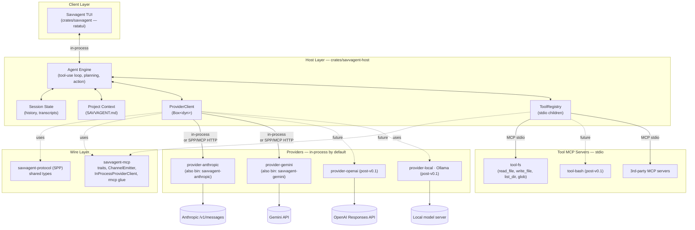

# Savvagent — Product Requirements Document

**Status:** Draft v0.2 · **Owner:** Rob Hicks · **Last updated:** 2026-05-07

---

## 1. Vision

**Savvagent is a blazingly fast, open-source terminal coding agent — written end-to-end in Rust, with every LLM provider and every tool implemented as a Model Context Protocol (MCP) server.**

Adding a new model is writing a small standalone binary. Adding a new tool is writing a small standalone binary. The host is just an MCP client that orchestrates them and renders a TUI.

If [OpenCode](https://opencode.ai/) is the reference experience, Savvagent's pitch is the same UX with three things that matter:

1. **Speed.** Native Rust everywhere — TUI, host, providers, tools. No Node/Go runtime overhead, no JSON-only IPC layer between the engine and the renderer.
2. **MCP-native.** OpenCode treats MCP as one tool source among many; Savvagent treats MCP as *the* wire format for both tools *and* providers. One transport story to learn.
3. **Provider-as-binary.** Forking Savvagent to add a model means publishing a new crate, not patching the host.

---

## 2. Why now

The terminal-AI-coding-agent niche is established (Aider, Claude Code, OpenCode, Continue, …) but the OSS Rust slot is empty, and no major agent has bet on MCP as the *provider* transport. Most agents have:

- A monolithic binary with hard-coded provider SDKs.
- A separate (and lossy) plug-in story for tools.
- Latency that you feel in every keystroke through the TUI.

Savvagent's bet: by collapsing both halves onto MCP and writing the host in Rust, we get a smaller core, a sharper extension story, and a TUI that feels instant.

---

## 3. Inspiration: OpenCode

The diagram below is the OpenCode system architecture, adapted as our reference. Savvagent keeps most of these layers but flattens the Provider System and Tool System onto the same protocol.


What we keep from this picture:

- **Three-layer split** — client (TUI) ⇢ server-side engine ⇢ external providers.
- **State management** owned by the engine (sessions, history).
- **Project context** loaded from a well-known file (OpenCode uses `AGENTS.md`; Savvagent will use `SAVVAGENT.md`).
- **MCP for tool servers.**

What we change:

- **The Provider System is also MCP-shaped.** Every provider implements the same `ProviderHandler` trait and conforms to **SPP** (see §6). Providers are **linked in-process by default** via `InProcessProviderClient` (zero-RPC for the common case) and *also* ship as standalone MCP Streamable HTTP servers for wire-protocol debugging or out-of-process deployments.
- **One client to start.** Just the TUI. No SolidJS desktop, no IDE extensions, no Agent Client Protocol (ACP) — those become open questions for v0.3+.
- **Rust everywhere**, including the TUI (ratatui).

---

## 4. Goals & non-goals

### Goals (v0.1 MVP)

- A working terminal agent that can hold a multi-turn conversation with Anthropic or Gemini, read and edit files in the current project, and run commands — with sub-100 ms TUI input latency under typical use.
- A clean separation in which `savvagent-host` knows nothing about Anthropic, and `provider-anthropic` knows nothing about the TUI.
- A protocol (SPP) frozen enough to publish v0.1 on crates.io.
- Installing Savvagent on Linux/macOS/Windows should be downloading a single archive (or running a one-line install script) plus authenticating with a provider — either an env var like `ANTHROPIC_API_KEY` or running `/connect` once to store the key in the OS keyring. Each platform archive bundles the TUI plus the `savvagent-tool-fs` / `savvagent-anthropic` / `savvagent-gemini` MCP servers under a single installer.

### Non-goals (v0.1)

- Full multi-provider coverage — Anthropic and Gemini ship in v0.1; OpenAI and local-model (Ollama) providers are post-v0.1.
- Desktop or IDE clients.
- LSP integration.
- Sandboxing / permission prompts (tools run with the user's privileges; users are warned).
- Multi-session UI, conversation branching, undo.
- Auth beyond API keys in env / config file.
- Caching policy (providers decide for now).

### Explicit non-goals (long-term)

- Becoming a generic MCP IDE shell. Savvagent is opinionated about being an *agent* host, not a tool browser.
- Bundling vendor SDKs in the host crate. SDK-style code lives in per-provider binaries.

---

## 5. Architecture

### 5.1 System diagram



### 5.2 Layer responsibilities

| Layer | Crate(s) | Responsibility |
|---|---|---|
| Client | `savvagent` | TUI rendering, input handling, talks to host in-process via Rust API |
| Host | `savvagent-host` | Conversation state, tool-use loop, MCP client orchestration, project context |
| Wire | `savvagent-protocol`, `savvagent-mcp` | Shared SPP types, `ProviderHandler` / `ProviderClient` traits, `InProcessProviderClient` bridge, rmcp glue |
| Providers | `provider-anthropic`, `provider-gemini`, … | Translate SPP ⇄ vendor API; linked in-process by default, also ship as standalone MCP Streamable HTTP servers |
| Tools | `tool-fs`, `tool-bash` (post-v0.1), 3rd-party | Standard MCP servers; the host only sees `tools/list` + `tools/call` |

### 5.3 Workspace layout

```
ai-coder/
├── PRD.md                 ← this document
├── Cargo.toml             ← workspace
├── docs/images/           ← diagrams (incl. OpenCode reference)
└── crates/
    ├── savvagent/                ← TUI (formerly src/)
    ├── savvagent-protocol/       ← SPP wire types + SPEC.md
    ├── savvagent-mcp/            ← shared traits, ChannelEmitter, InProcessProviderClient
    ├── savvagent-host/           ← engine, ProviderClient + ToolRegistry, project context
    ├── provider-anthropic/       ← Anthropic provider + savvagent-anthropic bin
    ├── provider-gemini/          ← Gemini provider + savvagent-gemini bin
    └── tool-fs/                  ← filesystem tools + savvagent-tool-fs bin
```

---

## 6. The wire: Savvagent Provider Protocol (SPP)

The contract between host and provider servers is **SPP v0.1.0**, defined in `crates/savvagent-protocol/SPEC.md`. Headline points:

- One required tool per provider: `complete`.
- Input: `CompleteRequest` (model, messages, tools, max_tokens, optional streaming/thinking).
- Output: `CompleteResponse` or MCP tool error containing `ProviderError`.
- Streaming via MCP `notifications/progress` carrying `StreamEvent`s, gated by `STREAM_EVENT_KIND = "savvagent/stream-event"`.
- Optional `list_models`, `count_tokens` tools.

Hosts must not require optional tools. Providers configure auth out-of-band.

See `crates/savvagent-protocol/SPEC.md` for the complete spec and JSON schemas.

---

## 7. Milestones

M1–M5 have all landed; M6 (the v0.1.0 release) is the only remaining numbered milestone.

### M1 · Protocol & traits (✅ done)
- `savvagent-protocol` v0.1.0 with round-trip tests.
- `savvagent-mcp` `ProviderHandler` / `ProviderClient` / `StreamEmitter` traits + `ChannelEmitter` + `InProcessProviderClient` bridge.

### M2 · Anthropic provider (✅ done)
- `provider-anthropic` library implements `ProviderHandler`; the `savvagent-anthropic` bin wraps it as an `rmcp` Streamable HTTP server.
- Host links the provider in-process by default; the HTTP path is opt-in via `SAVVAGENT_PROVIDER_URL` and exists primarily for wire-protocol debugging.
- Streaming via MCP `notifications/progress` carrying SPP `StreamEvent`s — see the `rmcp` `ProgressDispatcher` gotcha in `CLAUDE.md`.

### M3 · `tool-fs` stdio MCP server (✅ done)
- `read_file`, `write_file`, `list_dir`, `glob` ship as a stdio MCP server (`savvagent-tool-fs`), spawned and reaped by `ToolRegistry`.

### M4 · `savvagent-host` engine (✅ done)
- `Host` owns conversation state, the tool-use loop (`run_turn_streaming`), in-memory transcripts, and project context (`SAVVAGENT.md`).
- Public Rust API the TUI consumes; no provider registry inside the host — it just holds a `Box<dyn ProviderClient>` plus a `ToolRegistry`.
- `examples/headless.rs` exercises the loop end-to-end against `tool-fs`.

### M5 · `savvagent` TUI on the host (✅ done)
- TUI routes every turn through `savvagent-host` with a streaming-token render path; transcripts persist to `~/.savvagent/transcripts/<unix>.json`.
- `/connect` swaps the active host atomically (keyring-backed credentials, `Arc<RwLock<Option<Arc<Host>>>>`); `/save` persists transcripts on demand; `/view` and `/edit` open files in the in-TUI viewer/editor.
- A second provider (`provider-gemini`) ships alongside Anthropic, validating the in-process bridge.

### M6 · Public release v0.1.0 (in progress)
- Distribute via **precompiled binaries** — `.tar.xz` for Linux (x86_64 / aarch64) and macOS arm64, `.zip` for Windows x86_64, plus shell (`curl | sh`) and PowerShell (`irm | iex`) install scripts that download the right artifact from GitHub Releases. Driven by [`cargo-dist`](https://opensource.axo.dev/cargo-dist/) — config in `[workspace.metadata.dist]`, workflow at `.github/workflows/release.yml`. Publishing to crates.io is *not* a release requirement (deferred until there's a clear external consumer for the libraries).
- README with one-paragraph install + first-run instructions covering both the install script and manual tarball use.
- License: MIT OR Apache-2.0 (already configured in workspace).
- **Open work before tag:**
  - Measure & defend the §8 perf targets — keystroke-to-render p99 ≤ 100 ms, host overhead over network RTT ≤ 20 ms, stripped binary sizes.
  - Decide on the TUI editor widget (see `tui-textarea` in §9).
  - Path canonicalization + project-root containment in `tool-fs` (Layer 1 hygiene from the sandboxing plan below — non-blocking but cheap to land).

### Post-v0.1 (v0.2 candidates, not committed)

- Providers: OpenAI, local (Ollama). (Anthropic and Gemini are already in.)
- Tools: bash (with allowlist), edit (structured), grep, glob (richer than fs glob).
- **Permissions / confirmation prompts** (Layer 2). Allow/ask/deny rules keyed by `(tool_name, path_pattern, command_pattern)`, configurable in `~/.savvagent/config.toml` and `SAVVAGENT.md` front-matter. Intercepted in `Host` before `ToolRegistry::call`; the TUI pauses the turn loop and prompts `y / n / always / never`. Sensible defaults: `read_file: allow`, `write_file: ask` outside project root, `bash: ask` always, `.env` / `~/.ssh`: deny.
- **Tool sandboxing** (Layer 3). OS-level per-process isolation for tool MCP servers. Linux via `bubblewrap` (project-root bind-mount, `--unshare-net`, `--die-with-parent`, optional seccomp-bpf belt); macOS via `sandbox-exec` profile; Windows deferred (AppContainer + Job Objects is the eventual target). The host wraps the spawn — the multi-call binary's `savvagent tool-fs` becomes the inner exec, so tools themselves don't change. Runtime cost is ~zero (kernel namespaces, native syscall speed); startup adds 10–50 ms once per session because `tool-fs` is a long-lived stdio child. Opt-in via `--sandbox` flag and per-tool config in v0.2; default-on candidate for v0.3 once defaults are proven non-annoying.
- **Crates.io publication** of `savvagent-protocol`, `savvagent-mcp`, and `savvagent-host` once an external consumer wants them as libraries.
- **Session resume.** Per-turn transcripts already persist; reload + replay is the gap.
- More slash commands beyond the existing `/connect`, `/save`, `/view`, and `/edit`: `/clear`, `/model`, `/tools`.
- v0.3+: LSP integration, IDE extensions (ACP-style), desktop app.

---

## 8. Success criteria

For v0.1 release, "done" means:

1. **It works.** A new user can download a precompiled `savvagent` binary, authenticate with a provider (env var or `/connect`), run it inside a project, and hold a multi-turn conversation that reads/writes files. Crates.io publication is *not* required for v0.1.
2. **It's fast.** TUI keystroke-to-render p99 ≤ 100 ms. Host-to-Anthropic first-token-latency overhead ≤ 20 ms (i.e. our processing adds little to the network round-trip).
3. **It's small (at v0.1).** Stripped release sizes at the v0.1 tag: each provider/tool shim binary ≤ 8 MB, host + TUI binary ≤ 12 MB, full-platform archive (all four binaries) ≤ 36 MB pre-compression. Regression budget: +20% per minor release — anything over that is a release blocker until either justified in writing or the budget is explicitly rebudgeted.
4. **It's hackable.** A new contributor can add a provider in < 200 LOC by copying `provider-anthropic` and swapping the translation layer.

---

## 9. Risks & open questions

- **rmcp maturity.** `rmcp` v1.6 is the assumed substrate; if its Streamable HTTP server has gaps, we may need to vendor / patch. Mitigation: M2 is the integration test — we'll know early.
- **MCP framing for streaming.** Wrapping vendor SSE → MCP progress notifications is a per-provider concern. We're betting the SPP `StreamEvent` shape is stable enough not to leak vendor quirks; round-trip tests guard this.
- **Project context format.** Is `SAVVAGENT.md` enough, or do we need YAML front-matter for tool allowlists, model pinning, etc.? Open until M4.
- **Tool sandboxing in v0.1.** We're shipping with no sandbox, only a warning. Acceptable for v0.1 because the user is opting in via `cargo install`, but it's the highest-priority follow-up in v0.2 — see the layered plan in §7 (Layer 1 hygiene, Layer 2 permission prompts, Layer 3 OS-level isolation via bubblewrap / sandbox-exec).
- **Multi-client transport.** v0.1 has the TUI link the host as a library. If we ever add a desktop client, we'll need a real wire (websocket? ACP? gRPC?). Deferred — the host's Rust API is the boundary that matters today.
- **TUI editor widget.** Both the prompt input and any in-TUI file editing need a text-area widget with multi-line editing, cursor movement, selection, and undo. Candidate: [`tui-textarea`](https://github.com/rhysd/tui-textarea) — a ratatui-compatible widget by rhysd that already provides these (plus search, syntax-aware behavior via optional features). Decision deferred to M5; tradeoff is the dep weight and styling flexibility vs. rolling our own minimal editor on top of `ratatui::Buffer`. The current `ratatui-code-editor` use is the placeholder we'd replace.
- **Context management / retrieval.** Long sessions and large repos will outgrow the model's context window; we'll need a strategy for selecting which transcript turns, files, and tool outputs to keep in-context. Candidate to evaluate: [`vecstore`](https://crates.io/crates/vecstore) — a pure-Rust embedded vector store that could back semantic recall over transcript history and project files. Decision deferred (post-M5); tradeoffs include embedding model choice (local vs. provider-hosted), index footprint, and whether retrieval lives in the host or behind an MCP tool server.

---

## 10. Glossary

- **MCP** — Model Context Protocol. The transport for both tools and providers.
- **SPP** — Savvagent Provider Protocol. A small layering on top of MCP defining the `complete` tool's request/response/event shapes. See `crates/savvagent-protocol/SPEC.md`.
- **Provider server** — an MCP server, one per LLM vendor, exposing `complete` over Streamable HTTP.
- **Tool server** — an MCP server exposing arbitrary tools over stdio.
- **Host** — `savvagent-host`. Owns conversation state, runs the tool-use loop, multiplexes provider + tool MCP clients.
- **Client** — for v0.1, the `savvagent` TUI. Future: desktop / IDE.
